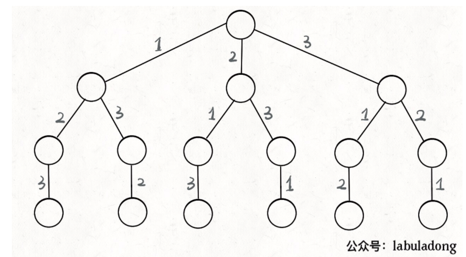
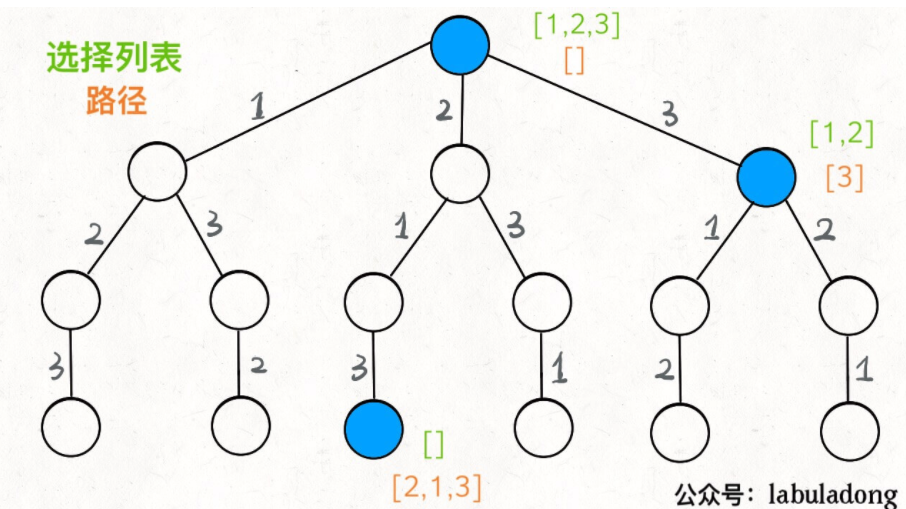

###     Notes 

- backtrack 肯定会用到递归
- 相信一个func 可以解决
- 对func 找好边界情况以及执行顺序


### [Notes from Fucking Algo](https://github.com/labuladong/fucking-algorithm) 

- 路径：也就是已经做出的选择。
- 选择列表：也就是你当前可以做的选择。
- 结束条件：也就是到达决策树底层，无法再做选择的条件。


代码方面的框架

```python
result = []
def backtrack(路径, 选择列表):
    if 满足结束条件:
        result.add(路径)
        return
    
    for 选择 in 选择列表:
        做选择
        backtrack(路径, 选择列表)
        撤销选择
```

**其核心就是 for 循环里面的递归，在递归调用之前「做选择」，在递归调用之后「撤销选择」**

#### 全排列问题 





**我们定义的 `backtrack` 函数其实就像一个指针，在这棵树上游走，同时要正确维护每个节点的属性，每当走到树的底层，其「路径」就是一个全排. 中间的`[2]` 就是「路径」，记录你已经做过的选择；`[1,3]` 就是「选择列表」，表示你当前可以做出的选择；「结束条件」就是遍历到树的底层，在这里就是选择列表为空的时候**

**回溯算法就是纯暴力穷举，复杂度一般都很高**。

**写 `backtrack` 函数时，需要维护走过的「路径」和当前可以做的「选择列表」，当触发「结束条件」时，将「路径」记入结果集**。


### leetcode 46 题总结

- 写好结束条件

- 记录好选过的道路（path) 和还有选的(choice)

- 撤销条件 

  ```go
          (*used)[i] = true
          p = append(p, nums[i])
          generatePermutation(nums, index+1, p, res, used)
         p = p[:len(p)-1]
         (*used)[i] = false // 撤销操作 
  ```
  


### leetcode 39 题总结 

- 定义好结束条件

  ```go
  if target <= 0 {
  		if target == 0 {
  			b := make([]int, len(c))
  			copy(b, c)
  			*res = append(*res, b)
  		}
  		return
  	}
  ```

  

- 选择

- backtrack 

- 撤销选择 

### leetcode 47题总结

- 和46 有点像， 主要是去重的逻辑
- 撤销选择 ? 


### leetcode 40题总结 

- 